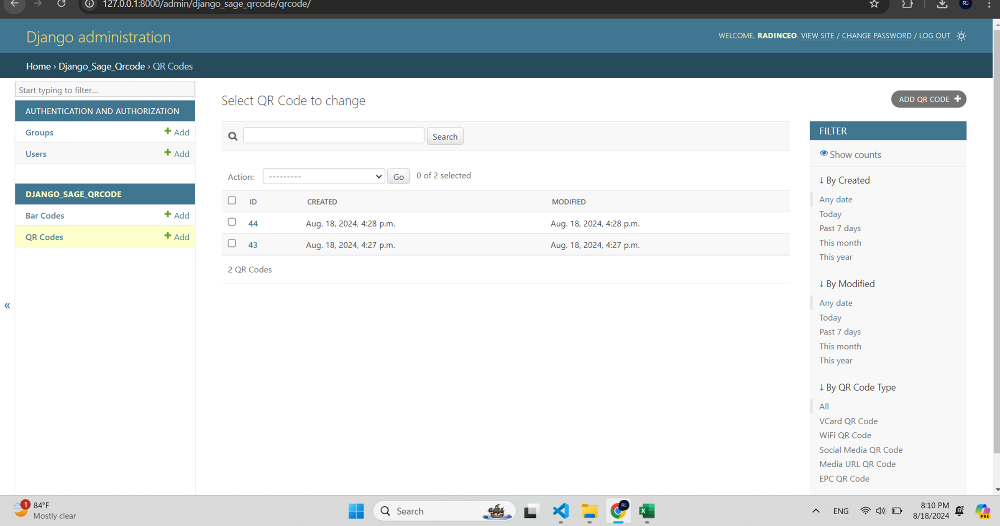
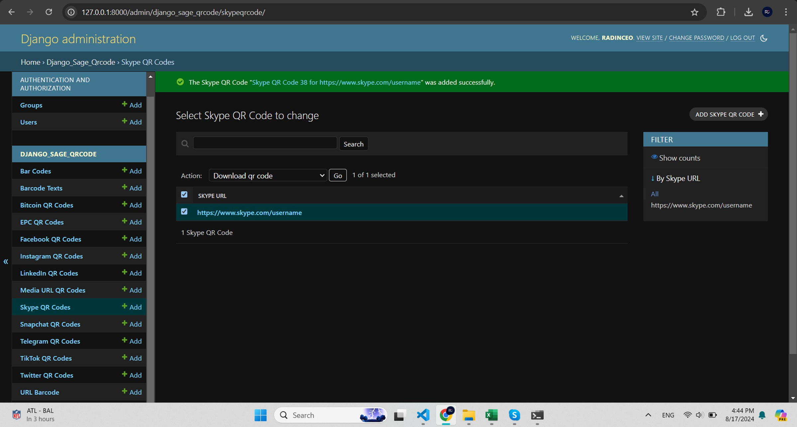
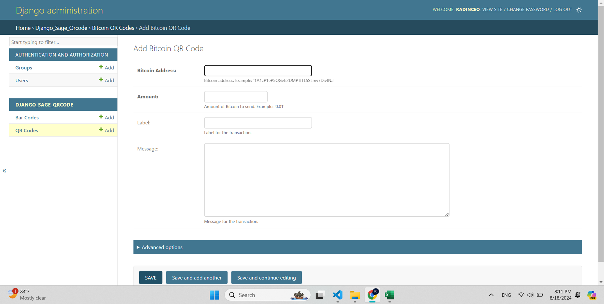
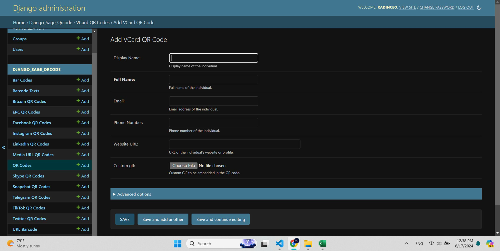
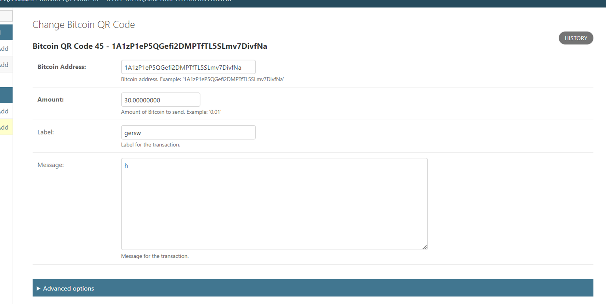
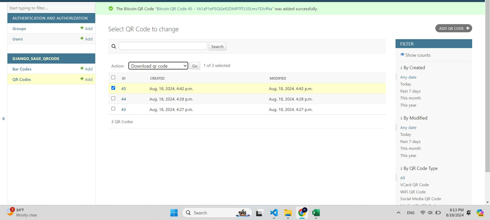

Admin Layer
===========

The admin layer customizes the Django admin interface to manage QR codes. This section explains how to configure and manage QR codes using the Django admin interface.

Managing QR Codes
-----------------

In the Django admin interface, you can manage various types of QR codes, including creating, editing, and deleting them.

Viewing QR Codes
----------------

To view the list of QR codes:

1. Navigate to the Django admin interface.

This will display a list of all QR codes, where you can select and manage them.

Adding a New QR Code
--------------------

To add a new QR code:

1. Click on the `Add QR Code` button on the top right.
2. Select the type of QR code you want to create from the list.

3. Fill in the details required for the specific QR code type.

You can Also Write Advanced options like color and size

4. Click `SAVE` to create the QR code.

Editing a QR Code
-----------------

To edit an existing QR code:

1. Select a QR code from the list to view its details.
2. Make the necessary changes.

3. Click `SAVE` to update the QR code.

Actions
--------------

The Django admin interface also provides a `Actions` section where you can see the latest activities performed on QR codes.

.. note::
    Some the Qrcode models support the option name custom gif the models that 
    support this feature you can see it in advance options